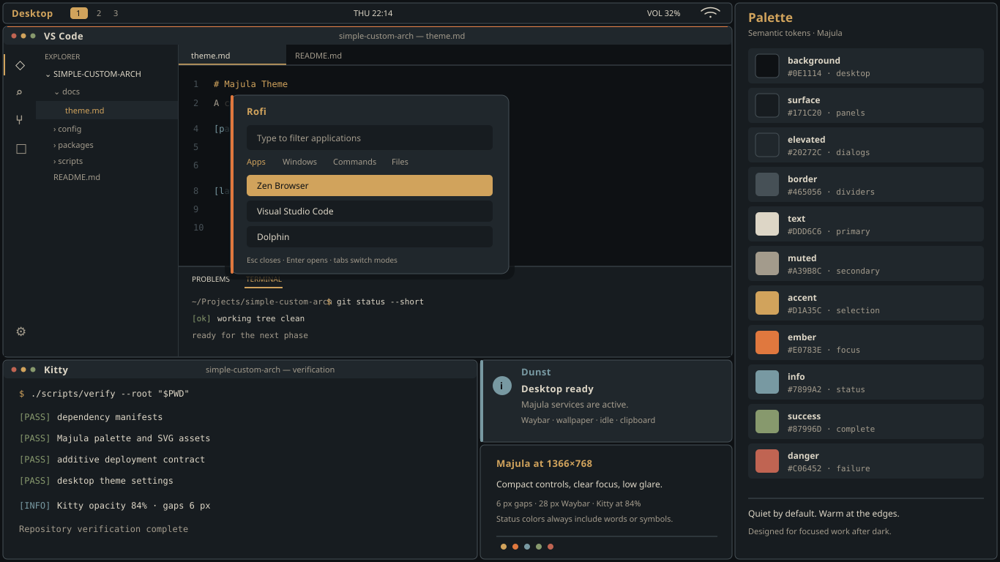

# Majula Theme

## Direction

Majula is a low-glare visual system built from dark stone, deep sea tones, aged ivory, and restrained sunset light. It takes atmosphere from Majula without copying game artwork, logos, or interface elements. The result should feel quiet and warm at night while keeping controls and status changes easy to read on a 1366x768 display.

## Compact Geometry

| Element | Size | Purpose |
|---|---:|---|
| Outer screen gap | `6 px` | Preserve a visible frame without sacrificing useful space. |
| Tiled window gap | `6 px` | Separate windows while keeping the layout dense. |
| Inactive border | `1 px` | Mark window boundaries with minimal visual weight. |
| Focused border | `2 px` | Show focus without reducing the usable content area. |
| Application title bar | `24 px` maximum | Keep window identity and controls compact. |
| Waybar | `28 px` | Retain readable system status at the approved font size. |

System-wide font sizes remain unchanged. Applications should hide redundant native title bars when doing so preserves clear window state and controls.

## Palette

| Token | Value | Primary use | Text contrast |
|---|---:|---|---|
| `background` | `#0E1114` | Desktop, terminal, and editor backgrounds | Base color |
| `surface` | `#171C20` | Waybar, panels, and inactive windows | Base color |
| `elevated` | `#20272C` | Rofi, notifications, and focused panels | Base color |
| `border` | `#465056` | Dividers and inactive borders | Decorative only |
| `text` | `#DDD6C6` | Primary text | 13.08:1 on `background`; 11.86:1 on `surface` |
| `muted` | `#A39B8C` | Secondary text, comments, and inactive labels | 6.88:1 on `background`; 6.23:1 on `surface` |
| `accent` | `#D1A35C` | Selection and active workspace | 8.21:1 on `background`; 7.44:1 on `surface` |
| `ember` | `#E0783E` | Focus, progress, and important actions | 6.25:1 on `background`; 5.66:1 on `surface` |
| `info` | `#7899A2` | Links and informational states | Use with a text label or symbol |
| `success` | `#87996D` | Successful operations | Use with a text label or symbol |
| `danger` | `#C06452` | Errors and destructive actions | 4.68:1 on `background`; not body text on `surface` |

## Component Mapping

| Component | Token usage |
|---|---|
| Hyprland | `background` for the desktop, `border` for inactive windows, and `ember` for the focused border. |
| Waybar | `surface` base, `accent` active workspace, `text` primary modules, and `muted` secondary state. |
| Rofi | `elevated` dialog, `accent` selection, `ember` important action, and `danger` destructive-state marker. |
| Kitty | `background` canvas at 84% opacity, `text` output, `muted` prompts, and semantic colors for terminal status. |
| Dunst | `elevated` notification, `info` status marker, `text` title, and `muted` details. |
| VS Code | `background` editor, `surface` chrome and sidebar, `elevated` active tab, and restrained semantic syntax colors. |
| GTK 3/4 | `surface` windows, `background` views, `elevated` controls, `accent` selection, and `border` separators. |
| Qt/KDE | The same window, view, control, selection, and semantic mappings through the Majula color scheme. |

## Preview

The preview is rendered at the target 1366x768 resolution and reflects the deployed components, compact geometry, and current Majula palette.

## Rules

- Treat these semantic tokens as the source of truth for project-owned interfaces.
- Keep `accent` and `ember` on small selections, borders, and progress elements instead of large surfaces.
- Follow the compact geometry table instead of adding application-specific padding.
- Pair information, success, and danger colors with a label or symbol so meaning never depends on color alone.
- Use application-specific colors only when they map clearly to a semantic token.
- Keep the preview and generated themes free of external assets and copied game material.
- Recheck contrast and the 1366x768 layout before accepting any palette change.
